# Rizen

    1. This  is  application  to use  anticipate  about Economic  data  from  data National
    2. I use to  technical  , that  is  Nodejs to  write  backend  and  Flutter  to  write  Frontend
    3. Database  is  Mongodb that   use  to  embedding vector   into  Database  easily
    4. Combination  Model Agent  of  RAG  (Retrive augement  generation ) , to be clear i use RAG combination of similarity search between answer word vector and image word vector to help  give Answer  better  and  combination  model  relearns itself after each answer if   answer  corrective  than 90%
    5.The app already has Two-Factor Authentication

# Technical

    1. Nodejs
    2. Flutter
    3. Mongodb
    4. Chart,ChatBOX,Another  Framework ... Etc

# Let Begin

1. Git clone : https://github.com/huynhanh48/Rizen

2. CMD:

```bash
 /* You  must to  start  Simulator */
cd Rizen/Backend
npm install
npm run dev
cd ../frontend
flutter pub get
flutter run  --hot

```

# User Interface

<h1>About</h1>
<p align="left">
  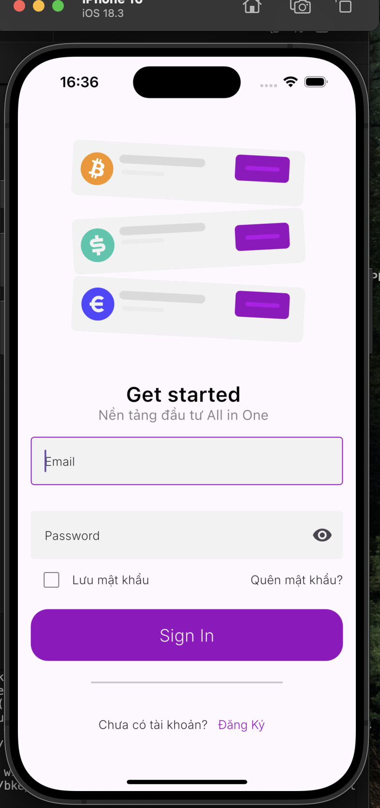
  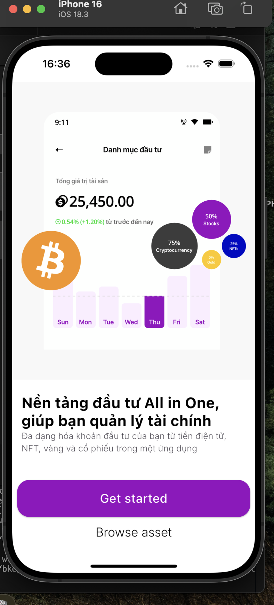
  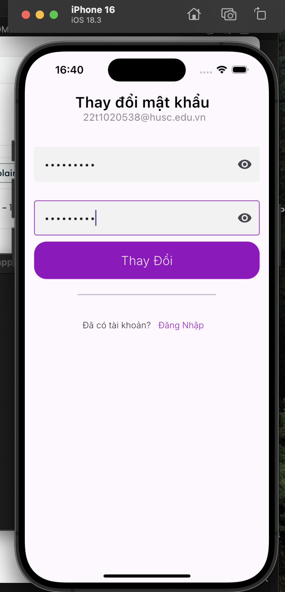
  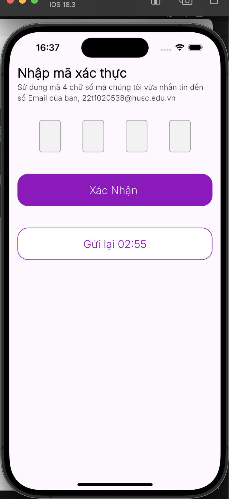
</p>
<h1>Main</h1>
<p align="left">
  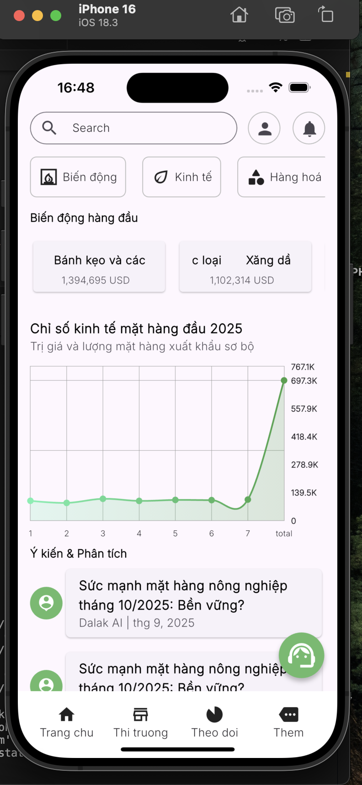
  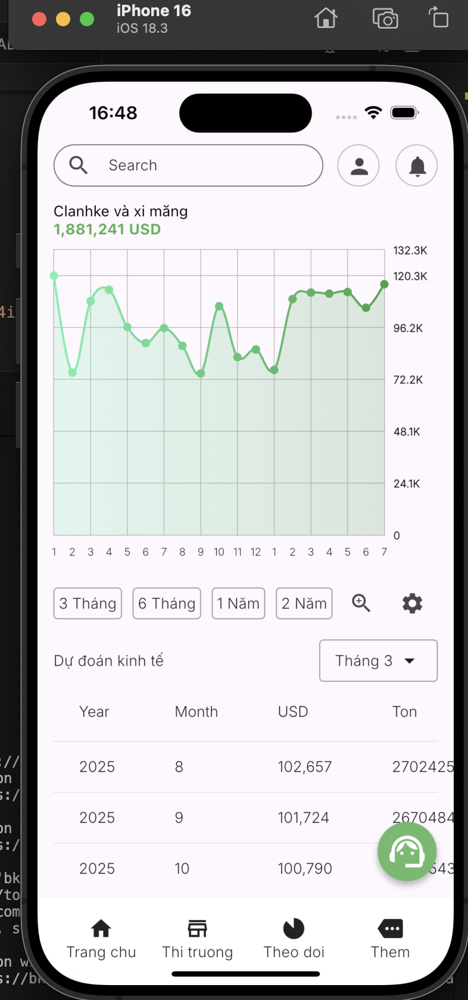
  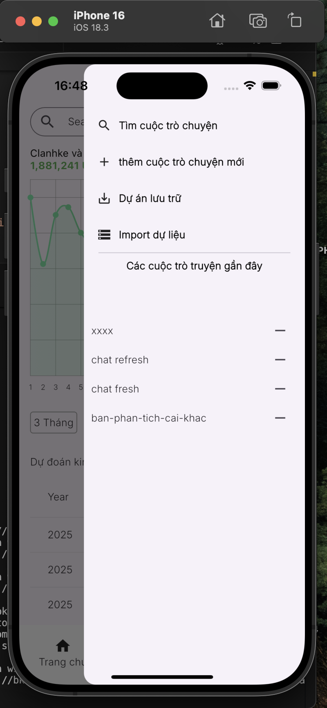
  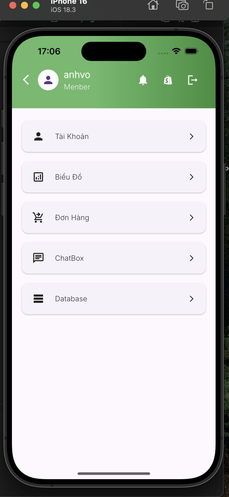
</p>
<h1>Chatbox</h1>
<div align="center">

  <div style="display: flex; justify-content: center; gap: 20px;">
    <div>
      <p>I import model with image and description about stock of BCM</p>
          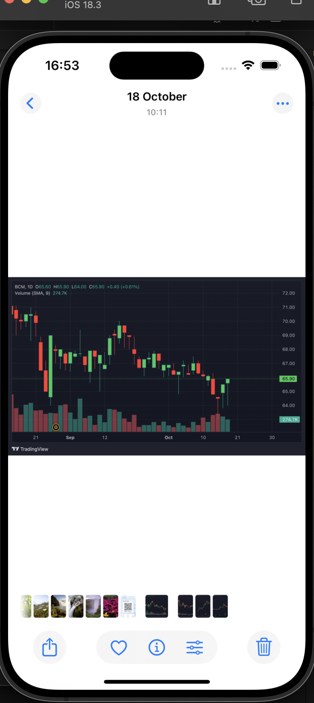
    </div>
      <div>
<p>Answer of question that is image of BID with trend down have similarity 98% with image original</p>
           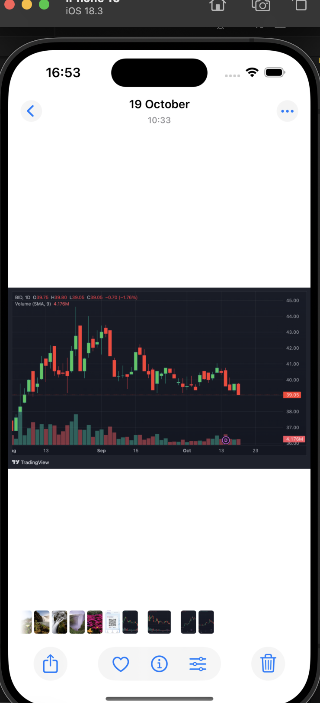
    </div>

  </div>

</div>
<h1>Result after 2 week</h1>
<div style="text-align:center;">
  <p>Chatbox Answer</p>
  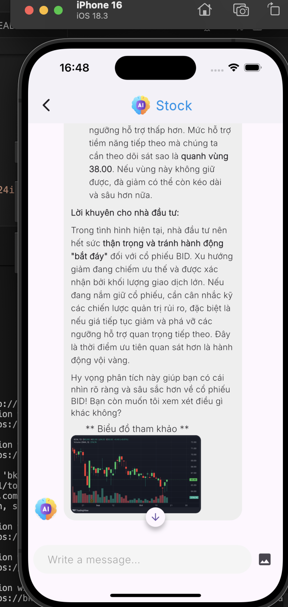
</div>
<p>Image have precidited after  2 week</p>
<div align="center">
  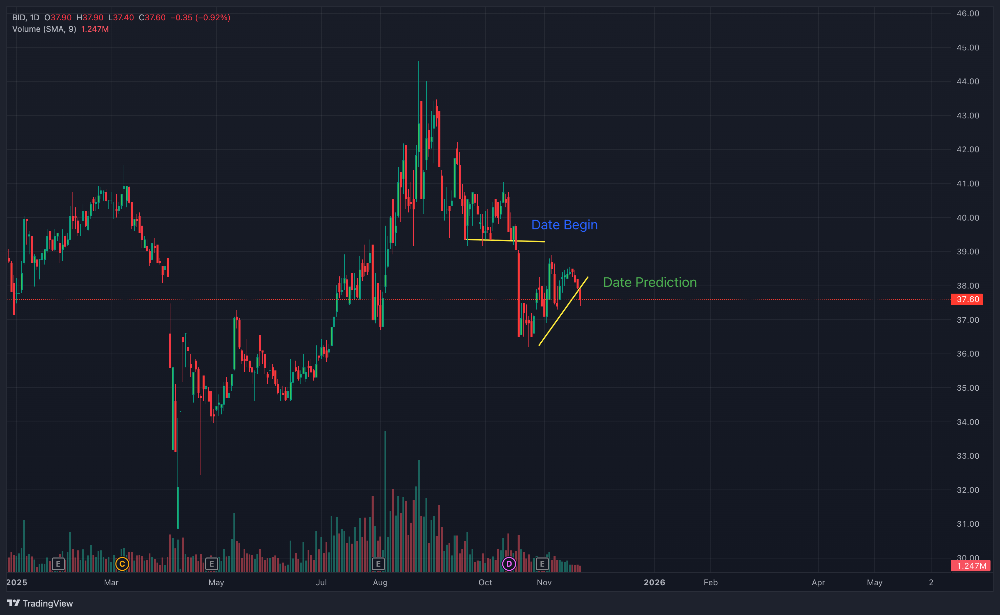
</div>

# Conclusion

    - All of the information I have supplied for  you  about  example  with  one stock supplied for next trend
    - That corrected  in  case  with  14 day  that is downtrend and  price  had price recovers
    - Model  need  import  a lot of  data than  to  improve accuracy
    - when price breaks a support point and rebounds back exactly as per BCM image with retracement 3 candles ago and starts to rebound again with  BID
